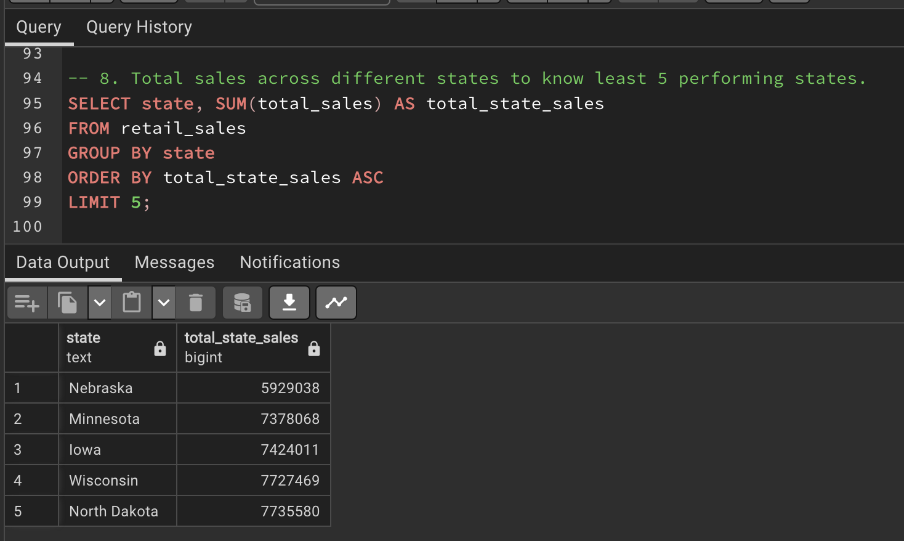

# Retail Insights-Exploring-Sales-Trends-and-Performance-Analysis-in-Adidas-Retail-Operations
Exploring Sales Dynamics, Regional Variations, and Profitability in Adidas Retail Operations. I present a thorough examination of Adidas' retail operations, shedding light on various aspects of their sales strategies, geographical distribution, and financial outcomes.

## Introduction
An Adidas sales dataset is a collection of data that includes information on the sales of Adidas products. This dataset includes details such as the number of units sold, the total sales revenue, the sales location, the type of product sold, and any other relevant information. Adidas sales data can be helpful in a variety of purposes, such as analyzing sales trends, identifying successful products or marketing campaigns, and developing strategies for future sales. It can also be used to compare Adidas sales to those of competitors or to analyze the effectiveness of different marketing or sales channels.

## Problem Statement
I wanted to explore Sales Dynamics, Regional Variations, and Profitability in Adidas Retail Operations. I present a thorough examination of Adidas' retail operations, shedding light on various aspects of their sales strategies, geographical distribution, and financial outcomes.
The following questions were asked and answers were provided to questions and problems below.
1. Calculate the total sales for each retailer in the table.
2. Determine the total units sold for each product category and Identify the product with the lowest total units sold.
3. Find the top-selling product categories by total sales.
4. Identify the days with the highest total sales.
5. Calculate the total sales for each sales method.
6. Find the region with the highest average operating profit.
7. Calculate the average price per unit for each product category.
8. Determine the top three states with the least total sales.

## Data Analysis
The analysis was done using a table that was provided. The table was the retail sales table.  

For problem 1, Calculate the total sales for each retailer in the table.  
By grouping the data based on retailers and summing up their total sales, we gain an understanding of which retailers have generated higher sales volumes. This allows us to easily compare the sales performance of different retailers. Retailers with higher total sales are likely to be more successful in terms of revenue generation.  
West Gear sold the most Adidas gear at $242,964,333 while Walmart sold the least Adidas gear at $74,558,410.  

                                                

2. Determine the total units sold for each product category and Identify the product with the lowest total units sold.  
This analysis helps distinguish between product categories that are performing exceptionally well and those that might need improvement. Categories with high units sold are likely popular among customers, while those with low units sold might require attention.  

                                                

3. Find the top-selling product categories by total sales.  
We calculate the total sales for each product category by summing up the "total_sales" column values and grouping the results based on the "product" column. The data is then ordered in descending order of total sales, highlighting the product categories that generate the highest revenue.  
The query provides insights into the product categories that contribute the most to the company's total revenue. This information helps in understanding the revenue distribution across different product types.  
Men's Street Footwear was the highest-selling Adidas product while Women's Athletic Footwear was the least-selling Adidas product.

                                                 

4. Identify the days with the highest total sales.  
The query reveals the specific days when the company experiences the highest total sales.  
By analyzing the days with the highest sales, companies can identify recurring seasonal patterns in customer behaviour. This information is valuable for tailoring marketing efforts and inventory management to match changing customer preferences.  
July 16th, 2021 represented the day for the highest Adidas sales and it was sold at Walmart.

5. Calculate the total sales for each sales method.  
By calculating the total sales for each sales method, businesses can evaluate how each channel (e.g., in-store, outlet, online) is performing in terms of revenue generation.

                                                 

                                               

6. Find the region with the highest average operating profit.  
By identifying the region with the highest average operating profit, businesses can pinpoint areas where operations are particularly profitable. This helps focus resources on maintaining and potentially expanding those regions.  
This analysis assists in making strategic decisions about resource allocation, marketing efforts, and investment strategies in regions that have a proven track record of high profitability.  

                                                

7.  Calculate the average price per unit for each product category.  
Calculating the average price per unit for different product categories allows businesses to compare pricing strategies across product lines. This insight can reveal which categories command higher prices and which might be more price-sensitive.  
Higher average prices might indicate strong demand for premium products within certain categories. Businesses can explore strategies to meet this demand while maintaining profitability.  
Understanding the average price per unit in each category can help businesses identify customer preferences. It provides insights into whether customers are willing to pay more for certain types of products.  
Women's Apparel had the highest price on average

                                              

8. Determine the top three states with the least total sales.
Identifying the states with the least total sales provides insight into regions where sales might be struggling. This information is valuable for focusing resources on improving sales performance in those areas.  
Low total sales in certain states could indicate untapped market potential. Businesses can investigate the reasons behind the lower sales and develop strategies to capture a larger share of those markets.  

                                               

